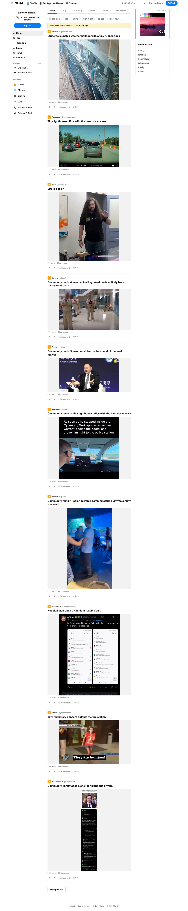
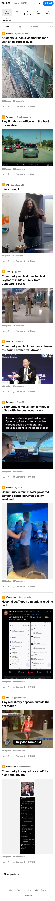
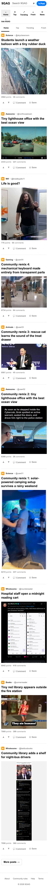

# 9GAG contributor-side final audit

## Scope

- Mirror: https://9gag.com/
- Local site: `http://localhost:40024/` (host verification port `41024`)
- Branch: `add-9gag-mirror`
- Base: upstream `main` at `3600493`
- Docker image: `sha256:0cf5649d5cb058fa05d1887a3559f78b327e84e5a78320f2aa6f795a2ab31dc6`

## Results

- All 25 registered WebHarbor sites started successfully.
- `/reset-all` returned every site as ready.
- All 20 9GAG tasks passed from the homepage through visible Playwright controls, with a fresh browser context and site reset for each task.
- 27 representative responsive checks passed across 1440, 390, and 320 px.
- No broken images, stretched images, horizontal document overflow, or out-of-bounds controls were detected.
- Five hardened search families returned 9–10 visible results; targets appeared at positions 2, 2, 4, 5, and 7.
- None of the task-specific detail facts appeared on search-result cards.
- Runtime and seed database MD5 after the final task run and `/reset-all`: `44768940829bf4a8bec07d7bdf072d97`.

## Seed inventory

- Posts: 80
- Users: 4
- Comments: 4
- Saved-post rows: 16
- Vote rows: 12
- Genuine captured post images: 38 unique files
- Additional captured 9GAG brand/interest references: 27 files

All four benchmark accounts use `@test.com` addresses and password `TestPass123!`. Both `seed_database()` and `seed_benchmark_users()` gate the entire function; repeated application left database bytes unchanged.

## Asset package prepared for Hugging Face

- Archive: `9gag.tar.gz`
- Managed members: 74
- SHA-256: `6ba9ca464d23bcae76316efff234548f75e428a7570f1d08f004c38a1123841c`
- The archive was validated locally and was not uploaded.

## Screenshots

### Desktop — 1440 px

### Mobile — 390 px

### Narrow mobile — 320 px

## Human integration steps

1. Upload the prepared `9gag.tar.gz` to the contributor's Hugging Face dataset fork and open an assets PR against `ChilleD/WebHarbor`.
2. After the HF PR merges, update `.assets-revision` to the merged asset commit.
3. Rebuild and rerun the 25-site health, reset-all, task, and MD5 checks.
4. Push `add-9gag-mirror` and open the GitHub PR, linking the merged HF asset commit and this report.

No Hugging Face or GitHub PR was opened during preparation.
