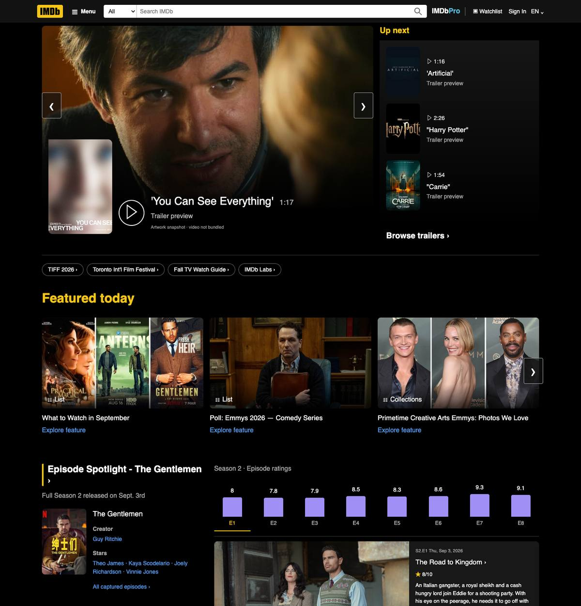
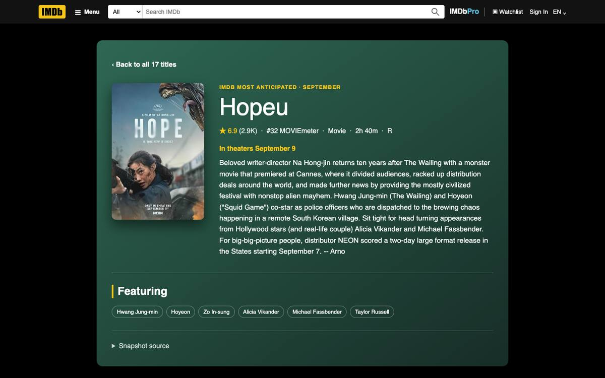
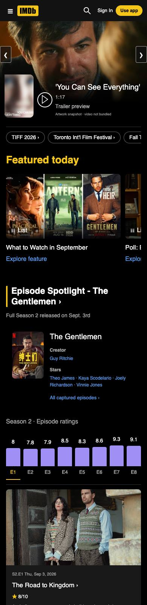
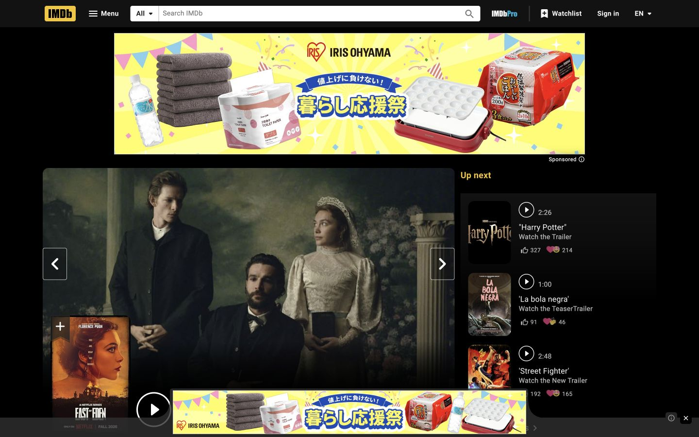
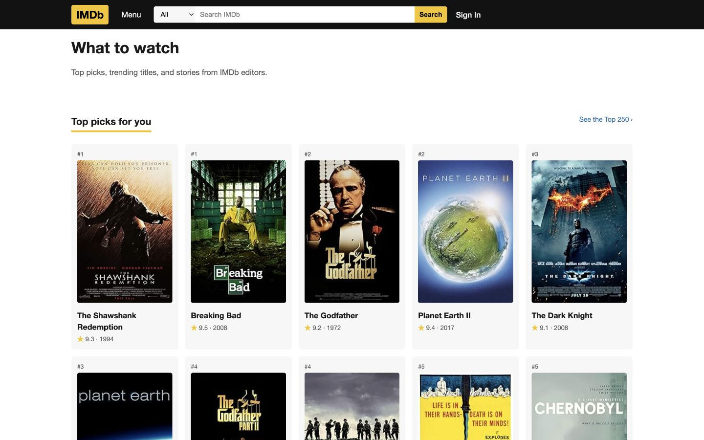
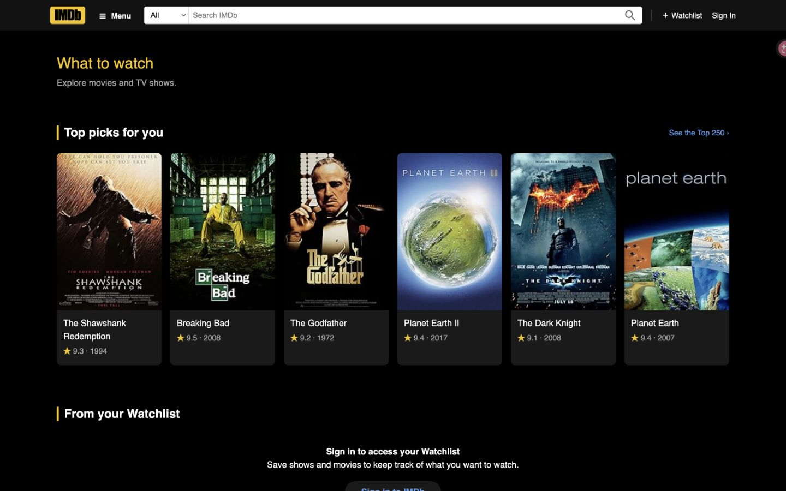
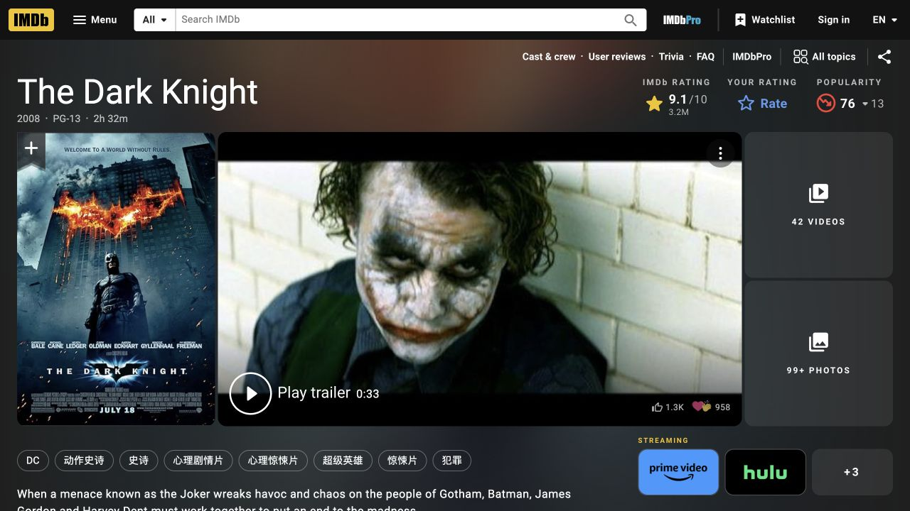
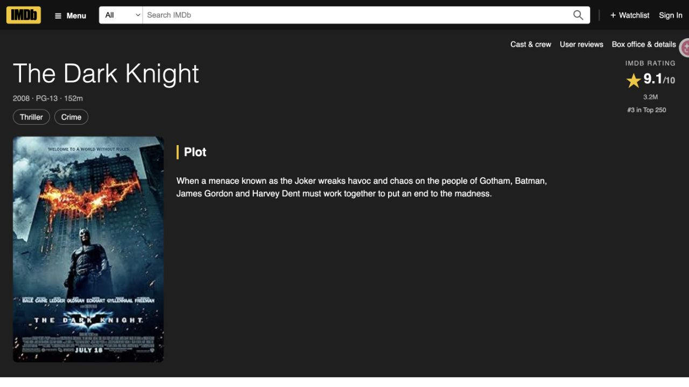

# IMDb reviewer validation

Status: **ready for maintainer review; nothing is merged.** The reviewed candidate is
the fixed pair below. Twenty accepted tasks each have a complete sealed UI run,
deterministic PASS, and an independent frozen-run PASS from a formal 20-task blind
review of this candidate; the Owner accepted the expanded visual result on 2026-09-12
after comparing it with live IMDb. This report revision is a docs-only commit on top
of the implementation fixed point; only files under `review-reports/` change.

This review preserves [@hqhq1025's original IMDb contribution, PR #33](https://github.com/aiming-lab/WebHarbor/pull/33)
and its commit history. The reviewer branch integrates `main` at
`36004932bdf82afbe36dc14e00f66841eccf9946`, including OSU, Rotten Tomatoes, Compass and
Walmart Careers, and appends IMDb at **40024** (25 registered sites).

## Fixed candidate

| Item | Value |
|---|---|
| Implementation fixed point (code) | `1c8a1eba19c084e202ecbab5977280701b9068c2` |
| Base | `36004932bdf82afbe36dc14e00f66841eccf9946` (`main`) |
| HF asset PR | [ChilleD/WebHarbor #57](https://huggingface.co/datasets/ChilleD/WebHarbor/discussions/57), open, no conflicting files reported |
| Pinned HF revision (`.assets-revision`) | `f9ddfd2596229f2610418d57fc88c3051e1056bb` (`refs/pr/57`) |
| `imdb.tar.gz` | 39,111,545 bytes, SHA256 `0663d30fe90ed2a0659dfe78ecf7ab1718970f565a64c6855a2c6aaadc606513` |
| Seed `instance_seed/imdb.db` | SHA256 `9d843c5388ecbc0d5265ac316cdaee915f8b203121b5a5330d207af5fb6206b0` |
| `sites/imdb/tasks.jsonl` | SHA256 `36214b6cf168c726d60e1ea0662ddfbfce6fa5dc77c804812460d1c38da545d8`, 20 rows |
| Local immutable check image | `sha256:edf9bbbd019813665fc169e39174db70c11969dcf182260f04d8f81636802dad` |

HF PR #57 lineage: `4d5709e` (first reviewer seed) → `e70f49d` (title-year
corrections) → `c2791ad` (union with asset main `18e64e4d`) → `f9ddfd25` (homepage and
editorial media plus the updated seed). Only `imdb.tar.gz` changes at `f9ddfd25`
relative to `c2791ad`; every other dataset path is byte-identical. The archive was
independently re-downloaded through the official HF client and matched the local
candidate on archive, seed and all 4,536 members (247 members added, none removed,
all pre-existing image/cache hashes unchanged). Asset main has since advanced to
`ad6f424f` with two unrelated archives (`fedex.tar.gz`, `webmd_doctor.tar.gz`); PR #57
still adds only `imdb.tar.gz` and reports no conflicts.

## Asset and source corrections

The original loader accepted unrelated profile payloads under a requested person ID.
It now checks the canonical IMDb identity. The asset migration uses exact official
`nconst` records to correct 642 corroborated profile collisions and canonicalize 47
uncertain alias/profile records, plus two independently supported birth years. It also
normalizes 390 complete release dates without inventing missing dates. Memento and
Schindler's List use their canonical title years while preserving their later regional
release dates. Credits, identifiers, synthetic users, reviews, ratings and watchlists
are preserved.

For 689 affected profiles, unsupported biography, birthplace and portrait links are
cleared; replacement text or portraits have not been generated. This is a
source-coverage limitation and does not mean that every retained image file was
individually proven wrong. See the
[source provenance and reproducible migration](../sites/imdb/docs/seed-provenance.md).
The original [asset PR #23](https://huggingface.co/datasets/ChilleD/WebHarbor/discussions/23)
is linked to this candidate; maintainers should coordinate the two so that the old seed
is not reintroduced.

IMDb's live ratings, box-office totals and front-page content change. This mirror
contains a fixed catalog; current source observations and historical values are
distinguished. The local **Domestic box office** page explicitly ranks catalog titles by
cumulative US & Canada gross and is not represented as IMDb's dated weekend chart. Test
users, watchlists, personal ratings and user reviews are synthetic benchmark state.

## Homepage and editorial expansion

The homepage now separates sourced editorial content from the benchmark catalog. A
separate `home_features` table holds 219 source rows captured from the logged-out IMDb
homepage on 2026-09-10 after lazy-loaded sections appeared: nine trailer artwork
previews, eight editorial previews, four topic links, one episode spotlight with eight
episode scores, five news previews, 25 streaming titles, 37 TV-schedule cards, 30
birthdays and the captured top-100 STARmeter. The
[What to Watch in September](../sites/imdb/docs/most-anticipated-2026-09-12.json)
editorial route was observed separately on 2026-09-12 (17 entries) and has a local
detail route per entry. All media is served locally; the importers validate official
source URLs and local file hashes and are build-time tools, not boot or reset hooks.
Sources, capture times and hashes are recorded in
[`homepage-sources.json`](../sites/imdb/docs/homepage-sources.json),
[`starmeter-sources.json`](../sites/imdb/docs/starmeter-sources.json) and the
[homepage snapshot notes](../sites/imdb/docs/homepage-snapshot.md), which also list
the remaining fidelity gaps (no trailer video files, editorial destinations show the
sourced preview only, no episode pages, no live showtimes/ticketing/playback, offline
information pages for app/commercial/social destinations).

Browser checks on the fixed candidate (Chromium, 1440×900 and 390×844): homepage and
`/feature/featured-today-1` returned HTTP 200 with no horizontal overflow; the feature
page rendered all 17 entries with locally bundled images; all 17 detail routes returned
200 with no overflow. Anonymous headless Chromium receives IMDb's 403, so the source
comparison relies on the Owner's browser session and the frozen source fields rather
than a new automated source capture.

| View | Candidate (2026-09-12) |
|---|---|
| Home, 1440 wide, top of page |  |
| Feature route, 1440 wide, top of page |  |
| Feature detail, 1440×900 |  |
| Home, 390 wide, top of page |  |

The earlier 2026-09-08 source/before/candidate comparison is retained below for the
pre-expansion state. [Capture purposes and hashes](assets/pr33-imdb/evidence.json)
identify every included image.

## Task and scoring scope

The candidate retains original IDs `0, 2, 7, 9, 10, 12, 14, 15, 16, 17` and retires
`1, 3, 4, 5, 6, 8, 11, 13`. Earlier retirements cover duplicate/shallow lookups with
answers exposed on cards, a count of static filter options, and helpfulness selection
where the seed has only one review. The final quality pass also removes tasks 3 and 4
because the first matching title detail exposes every requested value, and task 8
because its actor/character/birth-year combination has a stable common-knowledge
shortcut. All corresponding site features and original frozen executions remain intact.

To meet the Owner's minimum of twenty without restoring those weak tasks, the candidate
adds IDs `18–27`. Six are read-only relations or calculations: constrained pair
optimization, role-bound filmography intersection, full-filmography aggregation,
cross-account set subtraction, duplicate-review grouping and calendar-interval
comparison. Four are stateful: multi-item Watchlist qualification, cross-account
recommendation transfer, new-account queue persistence and a review-derived
personal-rating reconciliation. No prompt contains its answer, and no dated
editorial-page task was added merely to reach 21.

The revisions add needed detail lookups, specify movie/TV scope, define ties,
distinguish monetary fields, and replace the two requests for an external human's
choice with deterministic selection from each synthetic user's initial watchlist.
Questions, English rubrics and verifier entry points are kept in one-to-one
correspondence; expected answers are not placed in task rows.

The verifiers derive expected entities and values from the before snapshot. Read-only
tasks compare every business table. Stateful tasks permit only the specified row change
and require local UI action and subsequent page evidence. Alternative entry routes and
equivalent displayed monetary units are supported. Exact model prose is not required.

The [verifier interface](../sites/imdb/verify/README.md) runs offline with the standard
library. Synthetic tests cover ambiguous ties, entity/field binding, failed or foreign
navigation, wrong account/target, no-op changes, additional writes and legitimate
alternatives. The repository's native `eval_judge.py --verifier True` has also been
exercised with a synthetic positive and a foreign-origin negative; both produced the
expected verdicts. These fixtures are not browser trajectories. Safe recorder
placeholders `[SUPPLIED PASSWORD]` and `[REDACTED]` are accepted only when the snapshot
password hash matches the task-supplied credential and the same-origin login/register
transition succeeds.

## UI and functional review

The navigation uses an accessible menu drawer and usable search; home cards use the
dark palette, charts show poster/rank rows, and title details use a dark overview with a
separate facts section. Desktop and 390px layouts were checked in a real browser on
the fixed candidate with no broken images or page-width overflow. The Owner accepted
the expanded result on 2026-09-12; the fidelity gaps listed in the homepage snapshot
notes are explicit scope decisions rather than open defects.

| View | Original site | Before repair | Candidate (2026-09-08, pre-expansion) |
|---|---|---|---|
| Home, 1440×900 |  |  |  |
| Dark Knight, 1280×720 |  | Original audit retained separately |  |

Source/before used IAB and candidate captures used Chrome; these are visual comparisons,
not a calibrated pixel regression baseline. Source advertising and editorial content are
dynamic.

All state-changing forms use Flask-WTF CSRF protection, including both logout entry
points. Same-origin watchlist return paths are constrained, overflowing year input
returns 400, malformed email registration is rejected, and invalid review scores cannot
write a review. The application keeps its existing Flask/Jinja stack.

A frozen guided browser audit covered registration/login, failed inputs, watchlist
add/remove, personal rating and written-review persistence. A real form hosted on a
different localhost port submitted a rating without a CSRF token: the application
returned 400 and the entire database remained unchanged
([rejection screenshot](assets/pr33-imdb/csrf-rejected.png)). The audit exposed one
account-page GET logout link missed by handler tests; it was converted to a protected
POST form and rechecked in a real browser
([post-fix confirmation](assets/pr33-imdb/account-logout.png)). Out-of-range review
ratings were tested at the handler boundary; the browser UI only offers valid scores.
The later homepage expansion did not change these handlers; every accepted task path was
replayed on the fixed candidate (see below).

## Engineering results on the fixed candidate

Checks inside the immutable image built from code `1c8a1eb` and HF `f9ddfd25`:

| Check | Observed result |
|---|---|
| Full environment HTTP sweep | 25/25 HTTP 200 before and after the task regression |
| Control plane | 25/25 registered sites ready |
| IMDb dirty database reset | Runtime bytes equal the pinned seed SHA256 above |
| reset-all | All sites ready, 5.35 seconds |
| IMDb unit tests | 307 passed in 21.763 seconds |
| Guided replay of all 20 task paths from the homepage | 20/20 UI complete, 20/20 deterministic verifier PASS, 311 recorded steps, 13/13 read-only tasks left the database byte-identical, 7/7 write tasks produced the expected delta, 20/20 official resets restored the seed |

The image carries matching code and asset-revision labels and has no host mounts. It
was assembled from the already verified shared dependency image plus the exact fixed
code and the downloaded HF archive because the host did not have the headroom used for
an unknown-peak full rebuild; it is not represented as a fresh standard-Dockerfile
build. The [reproduction](#reproduction) path below is the standard source build. The
guided replay is implementation-informed change-impact regression; it is not new
independent exploration, does not replace the sealed canonical runs and is not a blind
review. Per-task results are in
[`candidate-regression-1c8a1eb-summary.json`](assets/pr33-imdb/candidate-regression-1c8a1eb-summary.json).

Historical results for code `50bcce5` (22-site integration at that time) are retained:
22/22 HTTP 200, byte-identical IMDb reset, reset-all 3.241 s, 146 and later 174
engineering tests
([mechanical output](assets/pr33-imdb/mechanical-results.json),
[engineering tests](assets/pr33-imdb/engineering-tests.txt),
[final ten-task scorer tests](assets/pr33-imdb/engineering-tests-final.txt),
[scorer identities and results](assets/pr33-imdb/scoring-results.json)).

## Frozen task executions and scoring

Each of the 20 accepted tasks has one complete canonical UI run with actual actions,
step screenshots, DOM snapshots, a final answer and before/after database snapshots,
totaling 311 recorded steps. Executions were recorded on earlier reviewed versions and
are disclosed as such; none is relabeled as an execution at the fixed point:

| Tasks | Code | HF revision | Seed SHA256 |
|---|---|---|---|
| 17 | r1 `ebe92f0` (commit plus recorded tracked patch) | `4d5709e` | `27558f13…` |
| 0, 2, 7, 9, 10, 12, 14, 15, 16 and 18–27 | r2 `50bcce5` | `e70f49d` | `69f849b9…` |

Reuse basis for the fixed candidate: `tasks.jsonl` and the `sites/imdb/verify` tree are
byte-identical between the expansion freeze `3d9fc72` and `1c8a1eb`; the logical
contents of all ten business tables are identical between the r2 execution seed and the
current seed (the current seed only adds the `home_features` table); the r1 seed used by
task 17 differs only on two title-year corrections for titles that task never reads;
and the code changes after the freeze add the homepage, feature/collection/news/offline
routes and a cookie-session recently-viewed list without touching search, charts,
genre, name, watchlist, rating, review, login, register or logout handlers. The guided
replay above closes the navigation-reachability risk introduced by the new base template.

The original ten runs contain 98 recorded steps and 80 successful substantive actions;
the ten expansion runs contain 219 recorded steps with no action or capture failure in
the selected runs. Task 18 preserves a one-step environment failure at an incorrect
viewport and task 21 an incomplete earlier attempt; neither is counted. Original run
files were never rewritten when scoring-format false negatives were fixed. Runners were
isolated from source, hidden answer keys and scoring outputs but retained their own
preceding UI context; runner models are self-declared in run metadata. These are not
fresh-context trials or an estimate of model success rate.
[Per-task results, paths and final screenshot excerpts](assets/pr33-imdb/tasks/task-table.md)
and the [structured record](assets/pr33-imdb/tasks/task-results.json) cover the original
ten; [public expansion counts](assets/pr33-imdb/task-expansion-summary.json) cover the
new ten.

Deterministic grading: the final native regrade passes 10/10 retained original main
runs and 3/3 separately recorded guided alternatives (a different legal cutoff tie for
task 9, Watchlist row removal for 15, Most-recent review confirmation for 17); all 30
applicable constructed cases (8 positive, 22 negative), seven historical controls and
one extra unit case match their prior expectations. The expansion runs pass 10/10 with
115/115 focused tests covering wrong owner, partial result, extra write, arbitrary
credential placeholder, incorrect grouping and field-binding negatives. The full IMDb
suite passes 307/307 on the fixed candidate. Fixtures are not browser runs and these
counts do not establish overall scorer accuracy.

The real runs exposed false rejections of task 17's headline reference, task 0's rank
prefixes/runtime difference, task 12's group labels and task 16's correctly reported
previous rating, plus a missed nested Remove button locator. The repairs distinguish
those statements and controls without relaxing task requirements; wrong headline
suffixes, ranks, comparison differences, old/current ratings, entities and extra
database writes remain negative controls.

Seven observed original paths used at least five successful substantive actions and
tasks 0, 12 and 14 perform comparisons; the expansion tasks add set, ratio and
multi-account reasoning over 11–35 steps each. Empirical frontier-model difficulty is
**NOT_VERIFIED**.

## Independent blind review

A formal blind review of the fixed candidate was completed on 2026-09-12 by Claude Code
with canonical model `claude-opus-5` (attested by the CLI usage record of the session,
which was fresh, non-persistent, restricted to read-only tools and had network tools
disabled). The input was a single neutral packet of 826 files covering all 20 canonical
runs (manifest SHA256 `09875b57a8c3f9092eae5f6f00fb619715dbecf5eeefd8f698ac2c5c5dc343fa`),
containing task text, answer-free rubric, trajectories, event/DOM evidence, screenshots,
final answers and before/after databases, and excluding verifier source/results, hidden
answers, coordinator conclusions, prior reviews, repository contents and PR discussion.
The reviewer verified 826/826 file hashes and returned **20 PASS / 0 FAIL**; the
structured result was hashed before it was read. Per-task bases and the reviewer's own
list of unexecuted checks are in
[`formal-blind-review-1c8a1eb-summary.json`](assets/pr33-imdb/formal-blind-review-1c8a1eb-summary.json);
the [PR comment](https://github.com/aiming-lab/WebHarbor/pull/89#issuecomment-5646790749)
records the same result.

The reviewer explicitly did not certify source fidelity, deterministic verifier
correctness, runner independence or live replay, and spot-checked screenshots rather
than auditing every step image. Two earlier probe reviews (10/10 on 2026-09-08 for the
original ten and 10/10 on 2026-09-10 for the expansion ten; models session-declared) are
retained as history in
[`independent-review-summary.json`](assets/pr33-imdb/independent-review-summary.json) and
[`task-expansion-independent-review-summary.json`](assets/pr33-imdb/task-expansion-independent-review-summary.json).

## Reconciliation

Comparing the formal blind result with the deterministic results task by task found
**zero differences and zero substantive findings**; no task, rubric, verifier, seed or
application change resulted. Common-PASS spot checks of tasks 9, 15, 16 and 17 against
the frozen DOM and independently recomputed full-table database diffs confirmed the
exact single-row changes (one Watchlist deletion, one rating update, one review insert)
and unchanged state for the read-only run. Details are in
[`reconciliation-1c8a1eb-summary.json`](assets/pr33-imdb/reconciliation-1c8a1eb-summary.json).

Two boundary rulings are retained:

- **Task 19** is graded from the amounts the mirror displays, as its text requires:
  `$30.1M / $52.0M` rounds to **57.9%**. Computing from hidden raw values would give
  57.8%; the unique maximum is unchanged.
- **Task 26** completed its registration, queue transfer, sign-out and re-login flow
  with exactly one new user and two Watchlist rows, but its run-start and seal-time
  metadata disagree (model label, prior-knowledge flag, runner identity wording,
  human-intervention list, resumed-session note). The completion verdict stands on
  direct run evidence; the run producer's provenance is not treated as a reliable
  independent-exploration attestation.

## Reproduction

Fetch the pinned candidate and build the source branch:

```bash
./scripts/fetch_assets.sh
./scripts/build.sh webharbor:review-imdb-pr33
docker run -d --name wh-review033-candidate \
  -p 127.0.0.1:8961:8101 \
  -p 127.0.0.1:49000-49024:40000-40024 webharbor:review-imdb-pr33
```

IMDb is then available at `http://localhost:49024/`. Run engineering tests with the
image's pinned Flask dependencies:

```bash
docker exec wh-review033-candidate \
  python3 -m unittest discover -s /opt/WebSyn/imdb/tests -v
```

For a supplied run bundle, use an absolute run directory:

```bash
uv run --project agent_demo python agent_demo/eval_judge.py \
  --verifier True --run_dir /absolute/path/to/run \
  --out /absolute/path/to/separate-scoring-result.json
```

## Known limitations

- Canonical runs were recorded on r1/r2 code and assets; their reuse for the fixed
  candidate rests on the identical task/verifier tree, logically identical business
  tables and the guided change-impact replay, not on re-execution at `1c8a1eb`.
- Runner models are self-declared in run metadata; task 26's provenance metadata is
  inconsistent (above).
- The blind review judged frozen execution completion only.
- The immutable check image was assembled from a verified dependency image rather than
  rebuilt from the standard Dockerfile; the reproduction path above is the standard build.
- Empirical frontier-model difficulty is not measured.
- 689 profiles have cleared biography/birthplace/portrait fields awaiting sourced
  replacements; the homepage snapshot notes list the remaining presentation gaps.
- The pinned HF revision is the open PR revision, not a main merge commit (see below).

## Maintainer handoff

**Directly mergeable now: no.** The code is mergeable against `main` (GitHub reports
MERGEABLE/CLEAN), but `.assets-revision` pins the open HF PR revision `f9ddfd25`
rather than a merged asset-main commit, and the project convention is to pin the HF
merge commit. Suggested order:

1. Review and merge [HF PR #57](https://huggingface.co/datasets/ChilleD/WebHarbor/discussions/57).
   It adds only `imdb.tar.gz` (LFS SHA256 `0663d30f…`) on top of asset main and reports
   no conflicts; asset main currently contains two unrelated later archives.
2. Confirm the merged asset-main commit still serves `imdb.tar.gz` with SHA256
   `0663d30fe90ed2a0659dfe78ecf7ab1718970f565a64c6855a2c6aaadc606513` and seed SHA256
   `9d843c5388ecbc0d5265ac316cdaee915f8b203121b5a5330d207af5fb6206b0`.
3. Update `.assets-revision` on this branch to that merge commit (or confirm that
   pinning the immutable PR revision is acceptable). Because the bytes are identical,
   only `./scripts/fetch_assets.sh` plus the hash check above need to be repeated; no
   task re-execution or new blind review is implied by a pin-only change.
4. Merge this PR, which supersedes #33, and close #33 and HF #23 with references so
   the old seed is not reintroduced.

The reviewer will not merge either the code PR or the HF PR.
