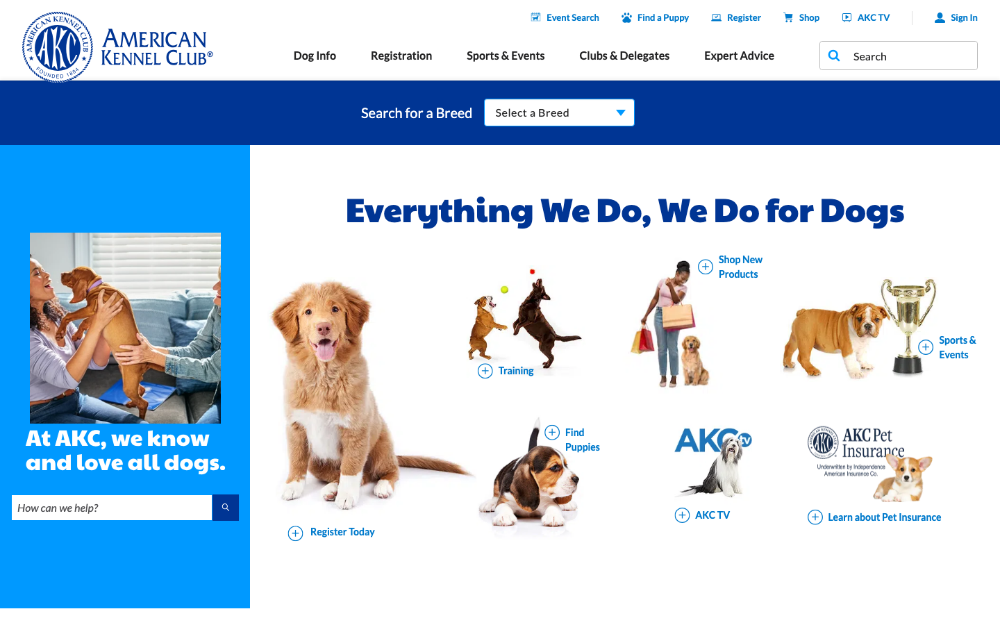
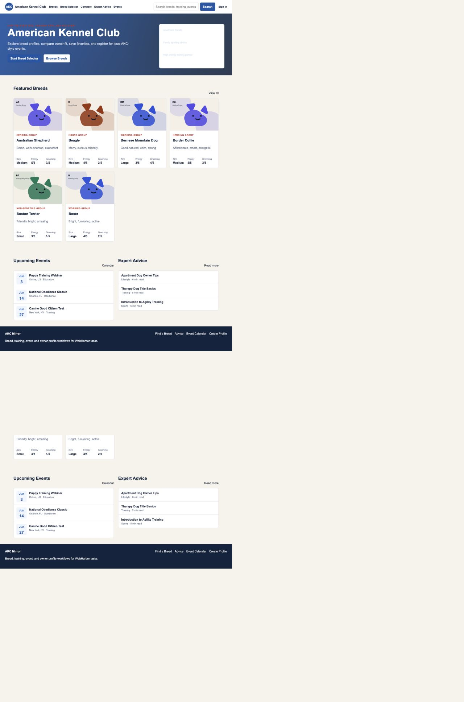
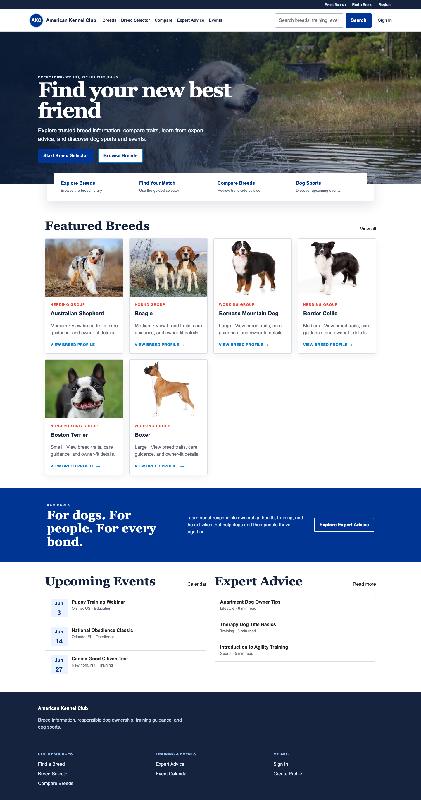
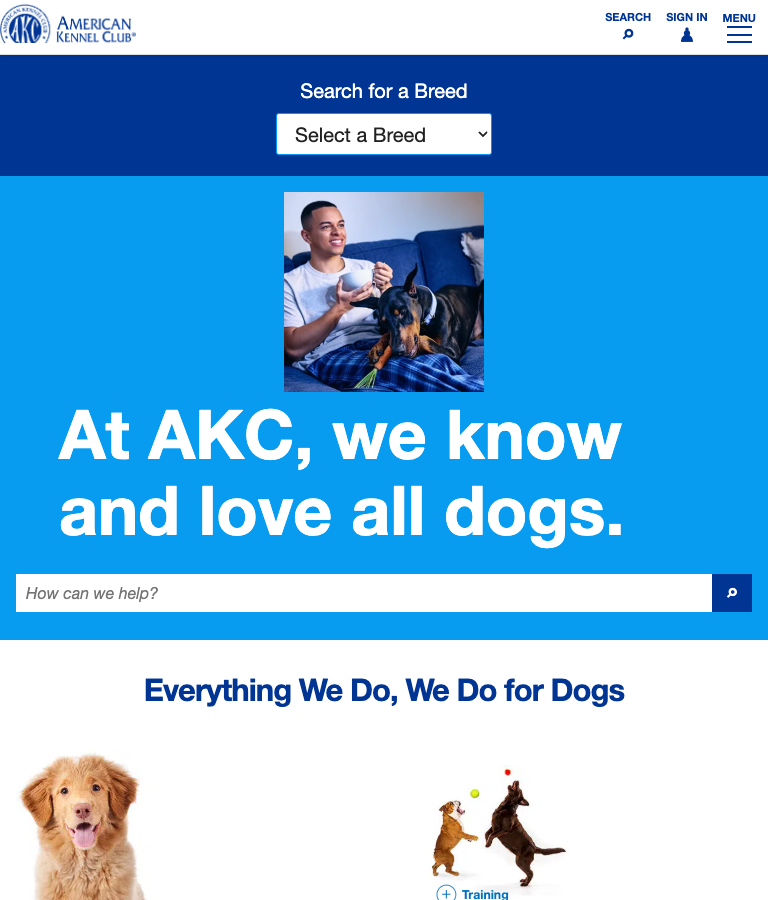
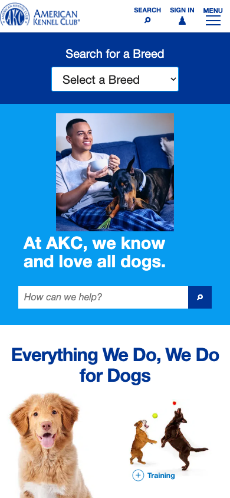
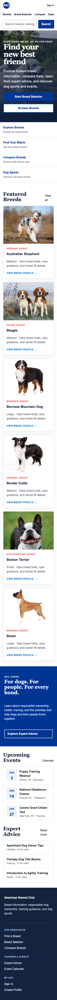

# AKC reviewer validation

Status: **Draft; not ready for maintainer handoff.** The reviewed implementation and
HF asset candidate are fixed below. All 13 canonical tasks have real browser runs,
deterministic PASS results, and matching independent blind-review PASS verdicts. The
fresh full Docker build is not yet run because the host is below the review procedure's
50 GiB free-space threshold.

This review preserves [@Sun-sunshine06's original AKC contribution, PR #40](https://github.com/aiming-lab/WebHarbor/pull/40)
as commit `83e9e6fb685bd2daf8b69aea2b0807e3add93f82` with the contributor's original
authorship. Reviewer fixes are later commits on an independent branch. The branch
integrates `main` at `454e7a49c37abe7eb074f6c86200a1308f109740`, assigns AKC
port **40040**, and keeps the registry at 41 sites.

## Fixed candidate

| Item | Value |
|---|---|
| Executed implementation fixed point | `8a06cfae154ec100feb00b194c2a64389a6756dc` |
| Current integrated code point | `b48637f68c7b5e4721d5c33290b6b8d85e5c2664` |
| Base | `454e7a49c37abe7eb074f6c86200a1308f109740` (`main`) |
| Original contribution | `83e9e6fb685bd2daf8b69aea2b0807e3add93f82`, original author preserved |
| HF asset PR | [ChilleD/WebHarbor #97](https://huggingface.co/datasets/ChilleD/WebHarbor/discussions/97), open |
| Pinned HF revision | `4b3879d288dabff17257e04b3b27e43b8628f63d` |
| `akc.tar.gz` | SHA256 `a06876a6fb239a340f03134bc66c443ffbaa5a1df43e739eb914cb338bc3f699` |
| Seed `instance_seed/akc.db` | SHA256 `3910bdaef81e20cbdc6bd39a33c6019a56f4e2769e1b8e8001ba59b9c396b727` |

The immutable HF archive was downloaded again through the official client and matched
the local archive, seed, and 24-file AKC asset inventory. The Dockerfile now requires
that pinned seed/archive instead of generating a non-reproducible salted seed during
the image build.

## Review findings and repairs

The original site supplied a useful Flask/Jinja foundation, AKC-shaped routes, seed
entities, and ten task ideas. The review found issues that prevented reliable
acceptance:

- the UI was sparse and used placeholders rather than a recognizable photographic AKC
  experience;
- the login page exposed seeded credentials;
- list cards disclosed facts that tasks were supposed to require opening detail pages;
- selector answers were posted without reproducible URL state;
- article identity and wording did not match the current official AKC article;
- the seed was regenerated with salted password hashes instead of being immutable;
- tasks had no deterministic verifier or browser-evidence contract;
- state actions accepted invalid values and allowed duplicate saved/registration rows.

The candidate keeps the original stack and contribution, while adding an AKC-like
responsive layout, 24 locally bundled official images, validated forms and uniqueness
constraints, reproducible selector/filter URLs, a pinned seed archive, 13 task-specific
offline verifiers, and focused application/verifier tests. Credentials are no longer
rendered in the UI. Task-critical facts are on detail pages rather than listing cards.

Official-source checks corrected the breeder article to
[Questions You Can Ask Your Potential Breeder](https://www.akc.org/expert-advice/nutrition/questions-to-ask-your-potential-breeder/)
by Randa Kriss and checked the Cavalier King Charles Spaniel dimensions against AKC's
breed material. Breed/event/user data used only for benchmark interactions remains
fixed synthetic state and is not represented as current live AKC data.

## UI and visual fidelity

The mirror and live source were opened side by side for human comparison. The candidate
uses local assets only. Four real responsive viewports—1440×900, 768×900, 390×844, and
320×568—showed no horizontal overflow. Browser console inspection after reload found
no warnings or errors.

| Original source | Original mirror | Candidate |
|---|---|---|
|  |  |  |

| Responsive candidate | Evidence |
|---|---|
| 768×900 |  |
| 390×844 |  |
| 320×568 |  |

The in-app browser's full-page stitcher duplicated already rendered blocks in its PNG
output even though the DOM contained one copy. Those PNGs were rejected; the retained
candidate images were recaptured with the project's existing Playwright Chromium
runtime. DOM counts, dimensions, and overflow checks were kept separate from screenshot
evidence.

## Task and verifier quality

The candidate has 13 tasks: nine read-only navigation/reasoning tasks and four exact
state-change tasks. Read tasks require filtered/search/account paths plus detail facts
or correctly bound comparisons. State tasks require the specified actor, UI action,
and exact SQLite delta, rejecting no-ops, wrong accounts, duplicate/extra writes, and
collateral changes.

Every task was run from a fresh seed through real Playwright Chromium UI actions. The
13 selected runs contain 71 recorded actions, step screenshots, exact task text and
final answers, plus initial/after SQLite snapshots. All 13 passed the repository's
`eval_judge.py --verifier True` path. See the
[per-task table](assets/pr40-akc/tasks/task-table.md) and
[structured results](assets/pr40-akc/tasks/task-results.json).

The real runs exposed one verifier false negative: native GET forms include untouched
empty controls such as `q=` or `state=`. Exact-query validation now treats
empty-only controls as absent while still rejecting any real extra narrowing. The
regression suite covers that legal browser path and retains the negative check for
additional non-empty query constraints.

The verifier unittest suite passes 13/13 methods and covers all 13 positives, compare
order alternatives, entity/value binding, knowledge shortcuts, wrong answers, extra
query narrowing, foreign origins, stale task text, failed actions, no-ops, wrong
actors/values, and collateral writes.

The frozen first-pass blind review independently returned **13 PASS / 0 FAIL** for
the same 13 runs. Its packet manifest SHA-256 is
`d43cdb643cd3ddcd60391005e2d9ed0ab9e4922864250c93eb01baf73afdff5a` and its
result SHA-256 is
`565d9bd94e0805183b0102a83ff8c26cbb61c1b769349251fbae582da80a1d36`.
The [public blind-review receipt](https://github.com/aiming-lab/WebHarbor/pull/134#issuecomment-5730265701)
records the scope and exclusions. Task-by-task comparison found no disagreement with
the deterministic verifier. A reviewer re-check of representative common PASS cases
covered the selector task (AKC--1), exact event-registration write (AKC--8), and
three-breed comparison (AKC--12).

After the blind result was frozen, current `main` was merged without changing AKC
application, seed, rubric, or verifier behavior. The only AKC task-file change is the
registry-driven base URL shift from port 40035 to 40040; existing runs used an explicit
case-local port and remain semantically applicable. Registry, asset, application, and
verifier checks were repeated on the integrated tree.

## Engineering results

| Check | Observed result |
|---|---|
| Canonical UI runs | 13/13 completed, 71 recorded actions |
| Deterministic grading | 13/13 PASS through `eval_judge.py --verifier True` |
| AKC app tests | 8/8 PASS in the project dependency image |
| Verifier tests | 13/13 unittest methods PASS |
| Anonymous route sweep | 58/58 HTTP 200, including all breed/article/event details |
| Registry | 41 sites consistent; ports 40000–40040 |
| Extracted assets | Full repository check PASS; AKC inventory 24/24 |
| Browser console | 0 warnings/errors after candidate reload |
| Responsive overflow | none at 1440, 768, 390, and 320 CSS pixels |
| Fresh full Docker build | **NOT RUN** — 41 GiB free; procedure requires 50 GiB before starting |
| Independent blind review | 13/13 PASS; 0 disagreements with deterministic grading |

Two failed diagnostic attempts are not counted as passes: a stale preview process still
held the old Python route until restart, and atomic replacement of a live SQLite file
left the pooled connection pointing at an obsolete inode. Canonical state runs instead
stop the case-specific preview, restore the immutable seed, restart, and then execute.

## Remaining gates

1. Free enough disk to reach the 50 GiB pre-build threshold and run the fresh full
   Docker build plus final image-level health/reset checks.
2. Mark the Review PR ready only if that remaining gate passes. Do not merge either PR
   from the reviewer account.

## Reproduction

Use the fixed branch and pinned assets:

```bash
./scripts/fetch_assets.sh
./scripts/build.sh webharbor:review-akc-pr40
./scripts/check_assets.sh
python3 scripts/check_site_registry.py
```

Then run the AKC application and verifier tests in the repository's supported Python
environment. The per-task verifier entry points are documented in
[`sites/akc/verify/README.md`](../sites/akc/verify/README.md).
