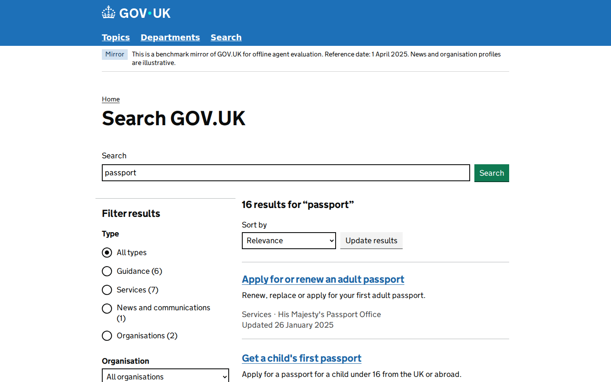

# GOV.UK PR #67: reviewed integration

The original contribution had short guidance pages and shallow task paths. The
reviewed integration expands search and guidance, aligns all 20 task definitions
and rubrics with the content, and replaces the graders with tested deterministic
answer and navigation checks. This incorporates PR #67 by @Django-Jiang and the
GOV.UK site contribution by @lamawmouk, preserving their commits.

## Changes

- Search across guidance, services, news and organisations, with type and
  organisation filters, sorting, result counts and pagination.
- 62 structured sections across 18 expanded pages, including supporting passport
  photo/fee, Blue Badge eligibility and France/Spain travel pages. Guides use
  separate parts or in-page contents, tables, conditions and related links.
- Organisation About pages and filtered content links. News listings contain
  summaries; three task-relevant news details have substantive reading content.
- All 20 tasks and rubrics require relevant facts, conditions or calculations.
  Navigation evidence is required, without an arbitrary minimum click count.
- Frozen SQLite seed, reproducible canonical builder and idempotent startup.




## Task and grading review

All 20 tasks were completed through screenshot-driven mouse, keyboard and scroll
interaction in fresh browser contexts and reset site instances. The 203 recorded
states and 20 GIFs are preserved locally. All 20 initial/final DB snapshot pairs
match, with no browser errors, document overflow or broken/pending images
recorded. Task 7 retains a recovered recorder keyboard error; harmless misclicks
are preserved. Later supplementary checks cover desktop/mobile layouts and the
final browse-grid/news-sidebar corrections.

| Task | Reviewed purpose | GUI completion / final verifier |
| --- | --- | --- |
| 0 | Income Tax allowance and taper calculation | PASS / PASS |
| 1 | Pension weekly rate and payment timetable | PASS / PASS |
| 2 | Filing/payment deadlines and payment reference | PASS / PASS |
| 3 | VAT categories and zero-rated versus exempt supplies | PASS / PASS |
| 4 | Pension qualifying years and personal forecast | PASS / PASS |
| 5 | Initial/daily penalties, including no tax due | PASS / PASS |
| 6 | CGT allowance, disposal-date rate and taxable gain | PASS / PASS |
| 7 | HMRC minister and tax-return preparation | PASS / PASS |
| 8 | DWP headcount and pension claim preparation | PASS / PASS |
| 9 | Treasury profile and two growth measures | PASS / PASS |
| 10 | Latest announcement publisher, date and measure purposes | PASS / PASS |
| 11 | HMRC filing statistics and late-filing advice | PASS / PASS |
| 12 | Passport renewal, fees and digital photo requirements | PASS / PASS |
| 13 | Blue Badge renewal and conditional eligibility | PASS / PASS |
| 14 | Skilled Worker sponsorship and evidence | PASS / PASS |
| 15 | Practical driving-test booking, fees and exception | PASS / PASS |
| 16 | Registration after moving and separate voter ID | PASS / PASS |
| 17 | France entry conditions and health insurance limits | PASS / PASS |
| 18 | Child Benefit eligibility, backdating and NI credits | PASS / PASS |
| 19 | NHS App capabilities, availability and limitations | PASS / PASS |

The final suite has **15 unittest methods**: 6 route/seed tests and 9 verifier
methods, including **30 positive and 72 negative answer cases** plus evidence
controls. Additional integration controls exposed and corrected swapped filing
method/date associations, a wrong daily-penalty threshold, valid alternative
pairs of growth measures, omitted photo units, reversed explicit width/height
order and equivalent decimal fee notation. All 7 added controls now match their
declared expected outcomes. Earlier controls cover wrong facts/units, number
formats, missing/corrupt screenshots, foreign origins and required navigation.

All 20 preserved GUI recordings were regraded with the final integration
verifier through `agent_demo/eval_judge.py --verifier True`; all pass. These are
regrades of real evidence, not 20 additional browser attempts. The secondary LLM
judge was not run; the optional-endpoint unit test uses a local stub.

## Integration validation

Integrated with main `a2479a06a7c659a4b24168f79032d28d49fe1c22` in commit
`a0066ee98b17eccd5a46564cc1cb255dbfe5bf2e`. GOV.UK is appended at index 32,
port **40032**. Existing sites retain their ports. The two registries, Docker
EXPOSE, task URLs and setup documentation agree on 33 sites.

- Fresh HF download, archive validation and extraction succeeded for all 33 sites.
- Downloaded GOV.UK archive/seed hashes match the reviewed copies. Anonymous
  download of the immutable asset commit also succeeded.
- Syntax, shell syntax, registry consistency and diff whitespace checks passed.
- Docker build `webharbor:pr67-integrated` succeeded (4.85 GB), image ID
  `sha256:88aaf0fc6b7fa0cc2f64721c9b1deb44e59ca89f478e714b0f535f50752205d2`.
- All 33 sites were alive; all 33 homepages returned HTTP 200. A GOV.UK crawl
  covered 277 URLs with HTTP 200 and no broken fragment targets.
- All 56 tracked GOV.UK runtime files in the image match the integrated source.
- Task 12 was repeated on the integrated image through GUI actions: 9 recorded
  states, no browser errors, official verifier PASS, and a decoded GIF retained.
- Four representative HTTP responses match the reviewed preview byte for byte.
- Reset after the GUI task restored a byte-identical runtime/seed DB:
  `10b0d0d51b45a223318a8698c0f2768cf88fea3dc7607f051376ccb635c58a63`.

Tests can be rerun after fetching the pinned seed:

```bash
python -m unittest discover -s sites/gov_uk/tests -v
python scripts/check_site_registry.py
./scripts/build.sh webharbor:dev
```

## Asset delivery and limits

[HF asset PR #93](https://huggingface.co/datasets/ChilleD/WebHarbor/discussions/93)
adds only `gov_uk.tar.gz`; all 36 existing repository files are unchanged from
its parent. The current HF account could upload but the merge endpoint returned
403. `.assets-revision` therefore pins `site.gov_uk` to the uploaded immutable
commit **`7c4daf7a6714654c609a9ccf97ab3b2431381791`**, following the existing
per-site mechanism. HF maintainer merge can be followed by a validated pin
update. Other site pins remain unchanged.

Archive SHA256:
`1c483241887bde14e3b629ff4acc10d5f54b46283c22bf8abfde2794360743fd`.

The reference date remains 1 April 2025. Current GOV.UK API responses and visual
captures informed structure and authored guidance summaries; see
[content provenance](../sites/gov_uk/CONTENT_SOURCES.md) for historical overrides.
The corpus is selective, some articles remain short, and profiles/news are
illustrative. No real applications, bookings or email messages are submitted.
English answer heuristics remain bounded; the controls do not establish universal
semantic accuracy or an independent benchmark-agent difficulty measurement.

Code integration is separate from Docker Hub publication and deployment.
The tested image has not been published to Docker Hub.

Evidence lives in `.assets/reviews/pr67-integration/` in the integration worktree;
the original audit/refinement evidence and all 20 GIFs remain in
`WebHarbor-pr67/.assets/reviews/pr67-refinement/`. The separate preview and gallery
are preserved. The owned integration test container is stopped after validation.
