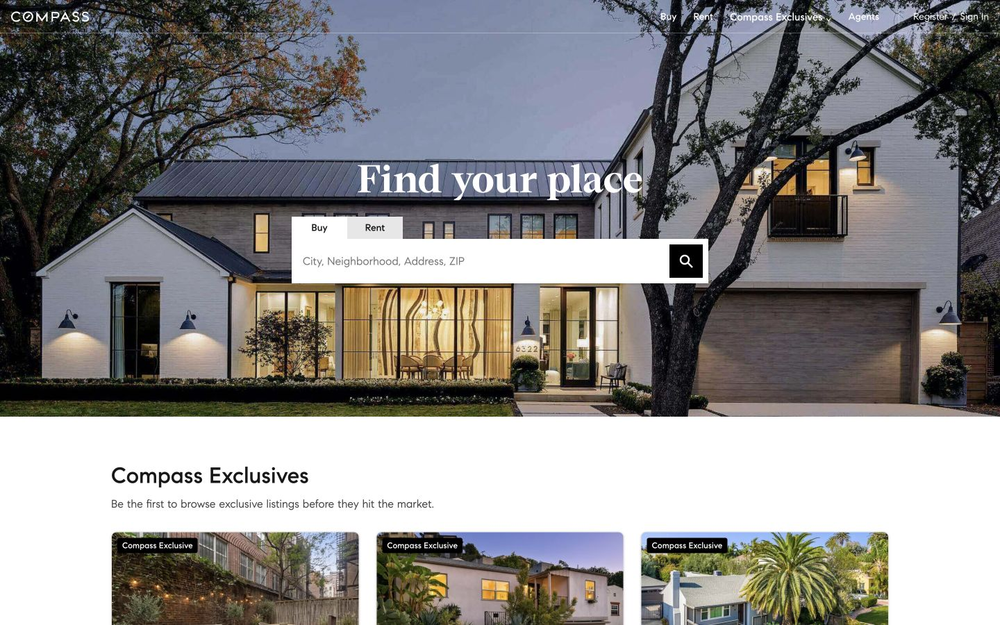
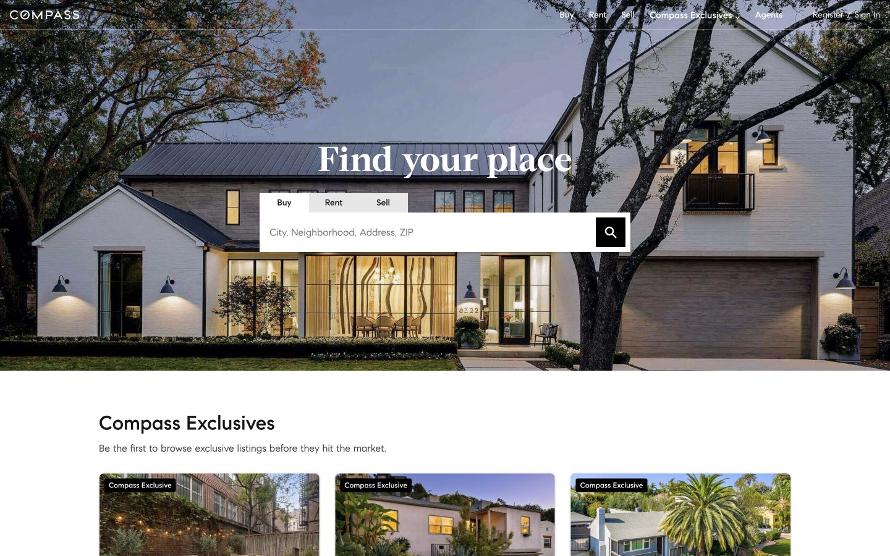
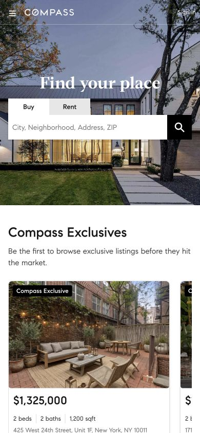
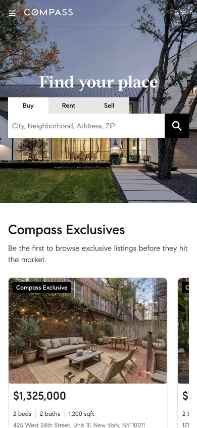
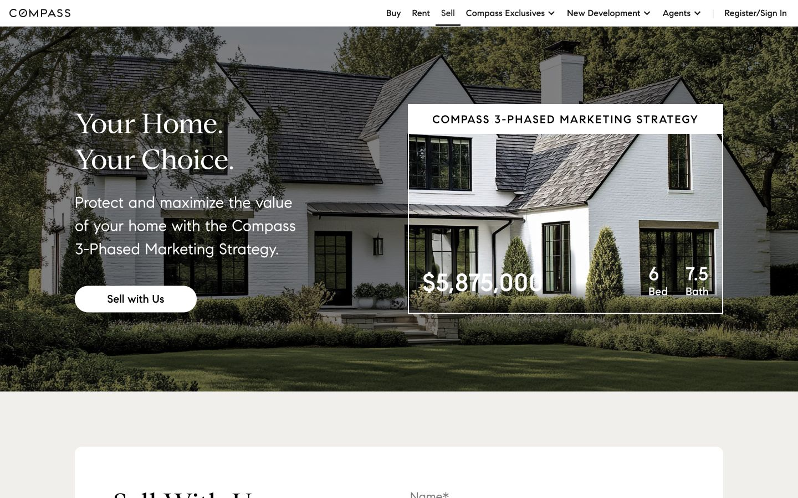
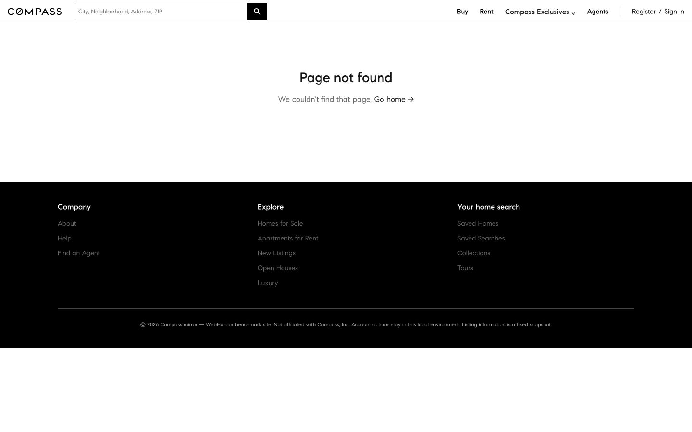
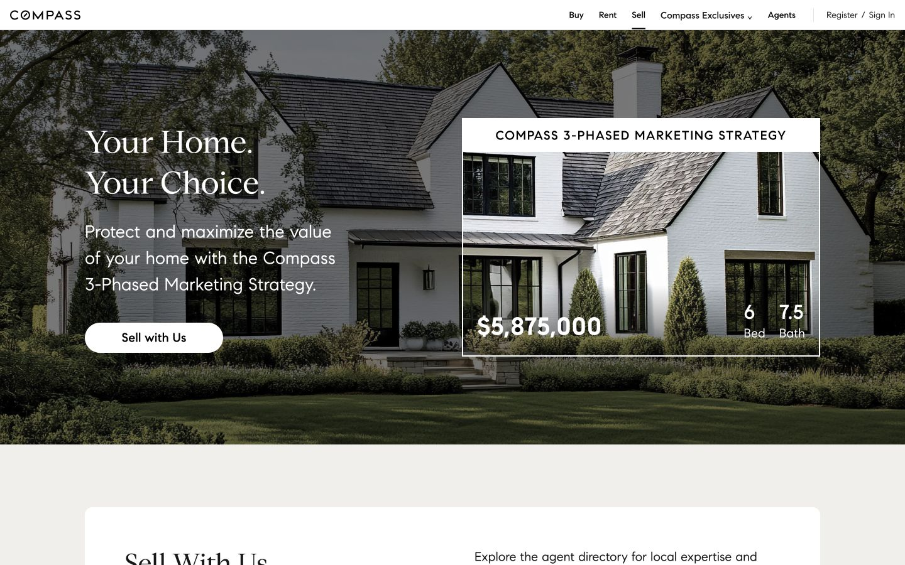
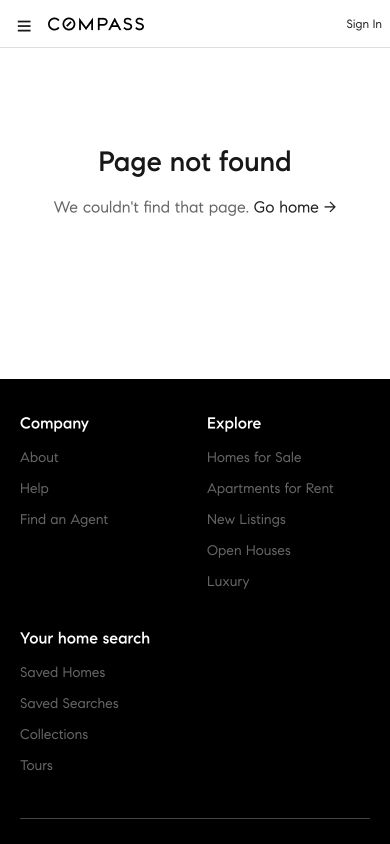

# Sell navigation and landing-page follow-up

Human inspection found a real omission: the top navigation and homepage Buy/Rent strip lacked **Sell**, and `/sell/` returned 404. The earlier seller-services scope note did not justify a missing primary entry.

The follow-up adds Sell to desktop navigation, the mobile menu and the homepage strip, plus a local `/sell/` page. The hero follows the [original Sell page](https://www.compass.com/sell/) using its locally packaged image, Compass fonts, transparent preview window and responsive ordering. **Sell with Us** scrolls to a local introduction; **Find an Agent** opens the existing agent directory. Buy and Rent keep their existing search behavior. `/sell` redirects to `/sell/`.

Application checkpoint: `a5e25af42b804bc56aeb49d5eb1c48c0a3a4b32c`; before: `7074f8dbd0c82088381657fd78b19ae400142248`. [HF PR #53](https://huggingface.co/datasets/ChilleD/WebHarbor/discussions/53) now supplies immutable revision `421ca6a529b88bdd214ecf6308d124798ab1e20b`. The 182,836,773-byte Compass archive has SHA-256 `2dce9cab8bb53cf27a100ca8e67b39743a7d8875384cc4993fb52b5e29460141`; all 2,412 prior files, including the seed, are byte-identical. The other 19 site archives also remain unchanged.

## Original / before / after

Unaltered, signed-out, top-of-page browser screenshots from September 6, 2026, at 100% browser zoom. Each row has the same actual pixel dimensions; metadata, URLs, times and SHA-256 values are in [sell-validation.json](sell-validation.json). A source timestamp marked `saved_at` is the file-save time, not a claimed exact browser capture time. Dynamic source recommendations differ from the fixed local catalog.

| Page / viewport | Original | Before | After |
|---|---|---|---|
| Home desktop (1440×900) |  |  |  |
| Home mobile (390×844) |  |  |  |
| Sell desktop (1440×900) |  |  |  |
| Sell mobile (390×844) |  |  |  |

## Measured changes and remaining differences

| Component | Source observation and implementation |
|---|---|
| Desktop hero | Source hero 659.33px high with a 1170px content width; candidate uses 660px / 1170px. The two-line heading uses Compass Serif 50px/65px; supporting copy uses Compass Sans 28px/42px. |
| Photo treatment | The preview is a transparent window onto the same full-width house photo. The candidate reproduces that structure and darkens the surrounding area; small differences remain in overlay strength and illustration facts' spacing/weight. |
| Mobile hero | At 390px: 32px/41.6px heading, 16px/25.6px copy, preview before CTA, and a 220×48px CTA. The section ends at approximately y=604 in both captures. |
| Local contact section | The source lead form is replaced by a clearly labeled agent-directory link. Contact copy, card spacing and lower-page content differ deliberately within the limited introduction-page scope. |
| Existing navigation | Sell is restored. New Development and the full online agent/service navigation remain outside the existing mirror scope; this is not a claim of complete site parity. |

The local page includes a short three-phase overview, not the original seller lead collection, full marketing carousels, embedded videos or service workflow. The illustrated price/bed/bath values reproduce the source marketing graphic; they do not add a catalog record or task answer. Existing benchmark differences are preserved: no answer facts were added to search cards, and accounts and writes remain local/synthetic.

## Verification and evidence reuse

- Real browser checks cover desktop Sell navigation, keyboard activation of homepage Sell, mobile menu entry, the contact anchor and agent-directory destination. Sell layouts were inspected at 320, 390, 768 and 1440px; authenticated navigation/account states at 768 and 1100px. Published captures have verified pixel dimensions, loaded fonts and no document overflow; hero loading was checked visually and by its local HTTP response.
- Existing Buy/Miami and Rent/New York searches still submit the appropriate sale/rent query, and Alice login/account navigation still work. **42 application/source tests passed** with 156 existing SQLAlchemy deprecation warnings. The earlier 124 verifier tests were not rerun: verifier inputs and code remain byte-identical, with hashes in the validation file.
- An incremental Docker image was built on the previously verified 20-site image. All six changed runtime files match the checkout and test container. All 20 site homepages return 200; Compass reset takes 0.712s and restores the runtime seed byte-for-byte. This follow-up did not repeat a clean download and full base-image build or reset-all; the earlier unchanged-site evidence is retained.
- The owner environment at port 40019 received those exact files and a Compass-only process restart. Its live database hash is unchanged; the other 19 processes were untouched.

The original 16 guided task runs and Claude's frozen verdict retain their original code/asset identities in [validation.json](validation.json). This change adds a read-only, task-independent page and navigation links; catalog, seed, task/rubric definitions, graders, and existing task handlers remain unchanged. Shared homepage/navigation entry points were rechecked above, so unchanged task-completion evidence is reused by impact, not described as newly executed. **Claude has not reviewed the new Sell page.** No human-approved screenshot baseline or calibrated similarity score is claimed. Human experience remains pending and the PR stays Draft.
