# Compass visual comparison

Captured on 2026-09-06 using the same browser viewport and top-of-page scroll position for each row. Images are actual browser captures, without compositing or synthetic reconstruction. Click a screenshot for its original resolution. Capture URLs, times, viewport dimensions and SHA-256 values are in [captures.json](visual-review/captures.json).

The before environment is original contribution `11b11cce5942be42cedc768f58e56db77e26696e` with its original asset PR. The after screenshots cover the source-backed refresh and UI fixes through `daa4a5bffd23728c149769f00da3fa7f51d7b0be`; later accessible-label and account-table changes do not alter these anonymous homepage/detail layouts. All screenshots show anonymous sessions.

Source pages: [homepage](https://www.compass.com/), [Aspen listing](https://www.compass.com/homedetails/501-W-Main-St-Unit-A101-Aspen-CO-81611/LRBC9_pid/), and [Miami listing](https://www.compass.com/homedetails/17145-SW-90th-Ave-Miami-FL-33157/1C7AS8_pid/).

The main corrections are official local fonts and hero imagery, measured header/search dimensions, readable listing cards, a five-tile desktop gallery, a separate 2:1 layout for two-photo homes, working photo/share dialogs, and mobile property actions fixed below the content. The original mobile mirror overflowed horizontally; the after captures do not.

## Homepage

| Original website | Before | After |
|---|---|---|
|  | [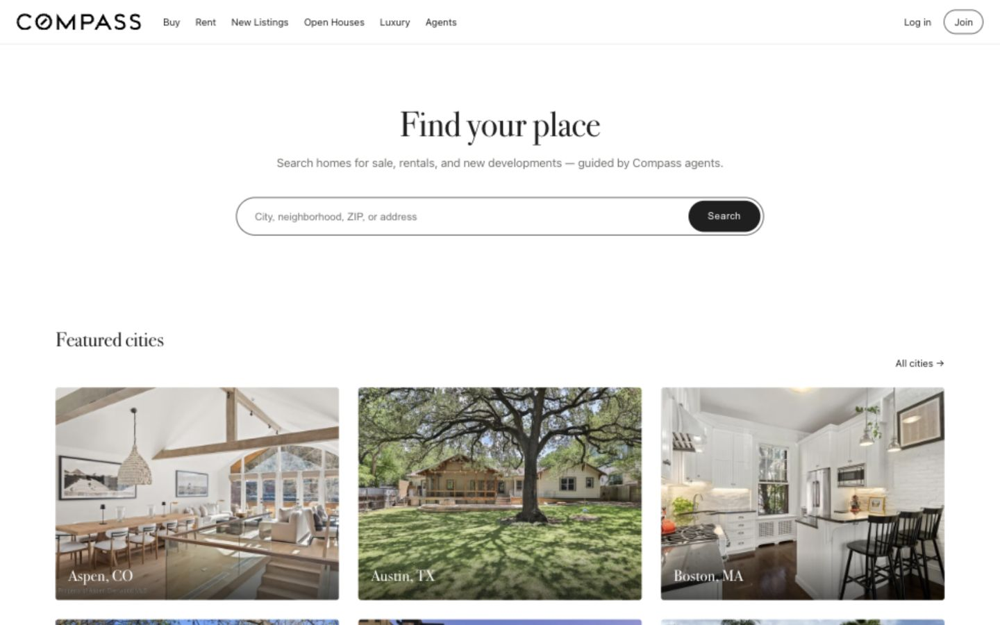](visual-review/before-home-1440.jpg) |  |

## Homepage, mobile

| Original website | Before | After |
|---|---|---|
|  |  | [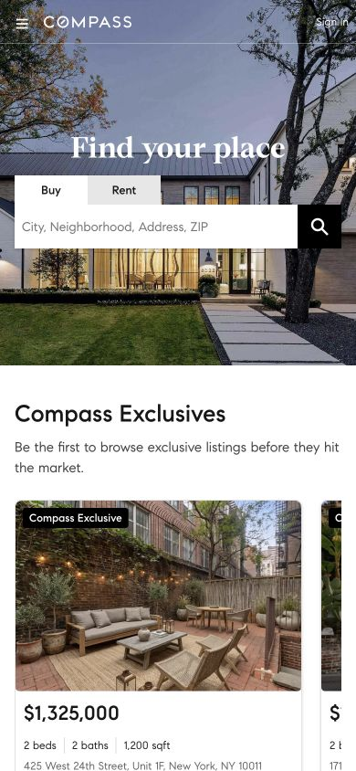](visual-review/after-home-390.jpg) |

## Aspen detail

| Original website | Before | After |
|---|---|---|
| [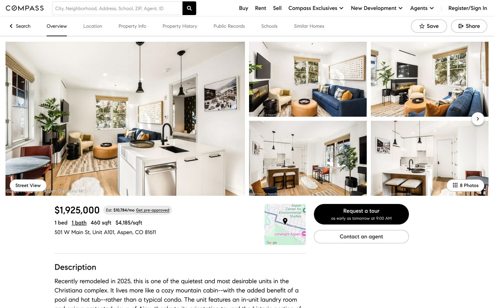](visual-review/original-detail-aspen-1440.jpg) | [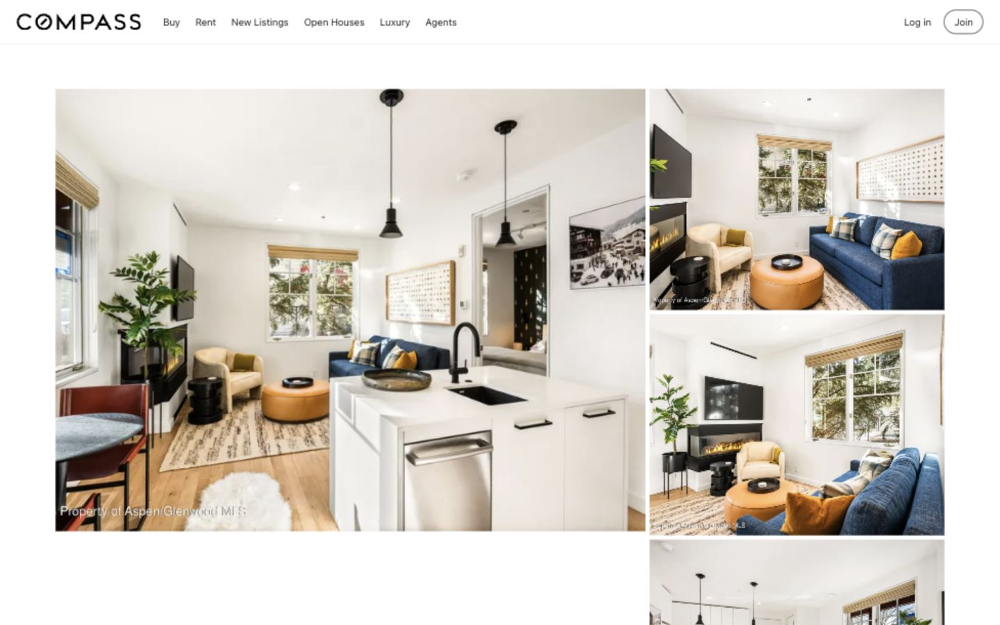](visual-review/before-detail-aspen-1440.jpg) | [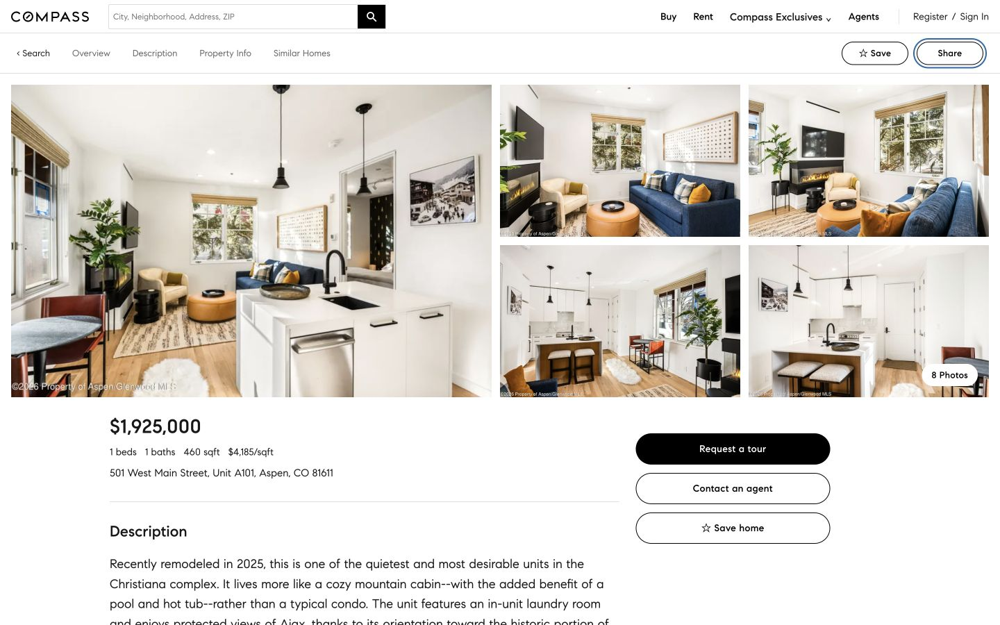](visual-review/after-detail-aspen-1440.jpg) |

## Aspen detail, mobile

The source mobile gallery failed to load its photo responses in this browser session. This source screenshot supports the layout comparison only; photo fidelity is established by the fully loaded desktop comparison above.

| Original website | Before | After |
|---|---|---|
| [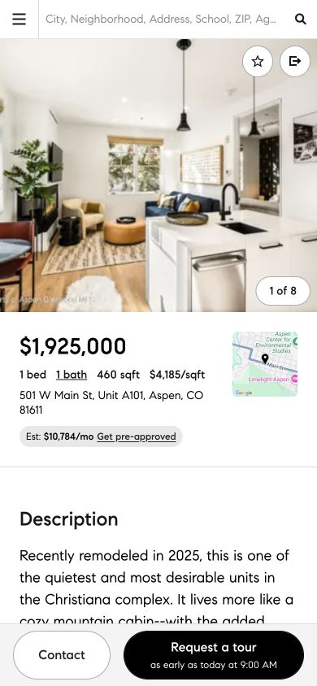](visual-review/original-detail-aspen-390.jpg) | [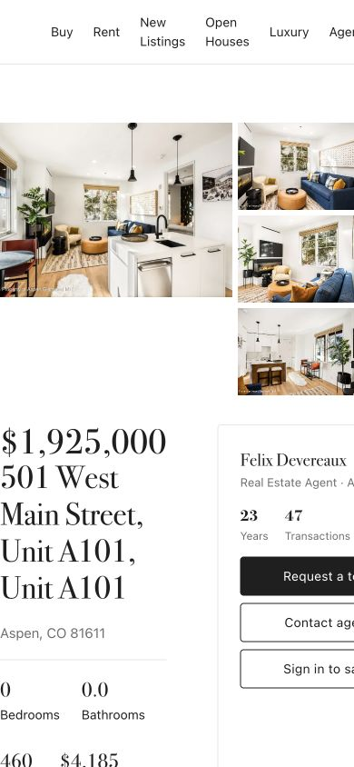](visual-review/before-detail-aspen-390.jpg) | [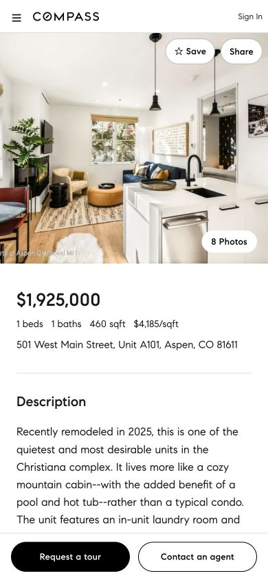](visual-review/after-detail-aspen-390.jpg) |

## Miami two-photo detail

| Original website | Before | After |
|---|---|---|
| [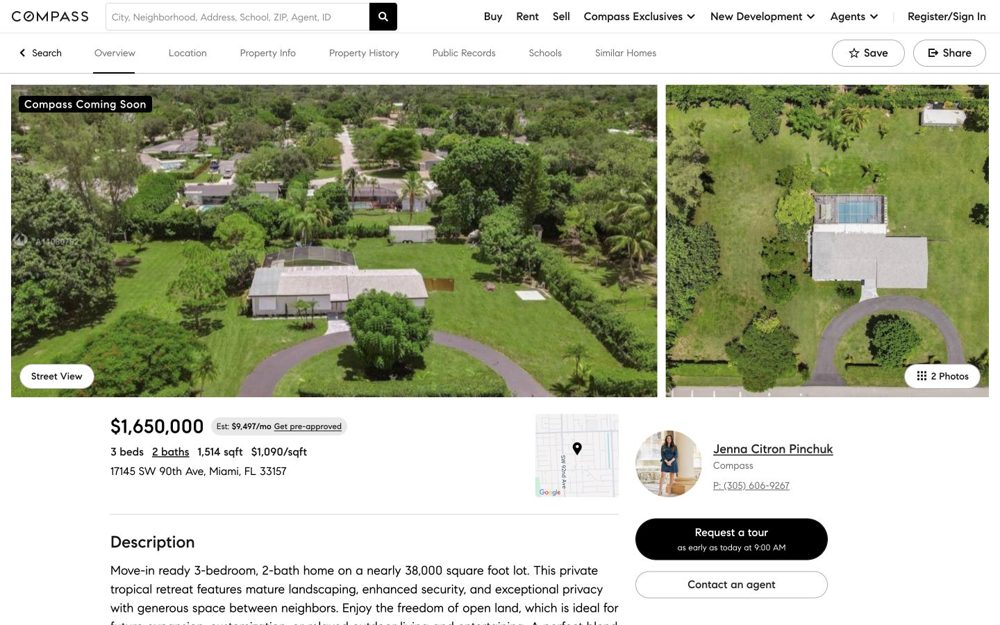](visual-review/original-detail-miami-1440.jpg) | [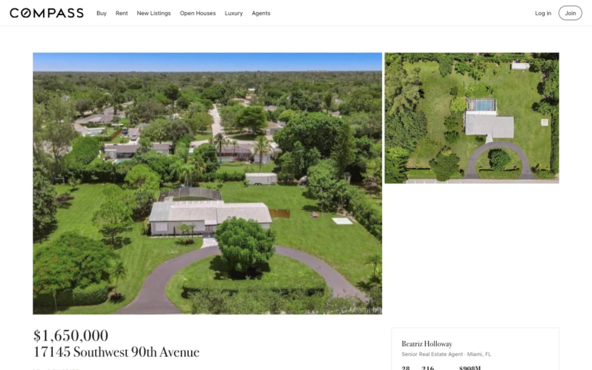](visual-review/before-detail-miami-1440.jpg) | [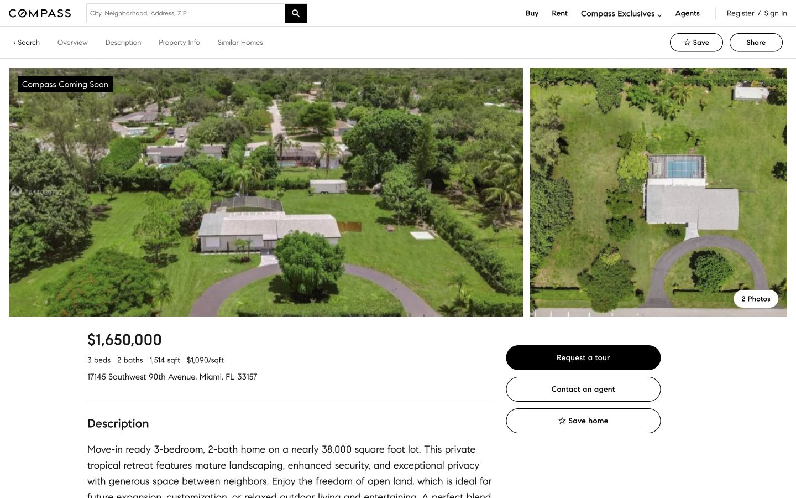](visual-review/after-detail-miami-1440.jpg) |

## Miami search results

The live site uses a map plus two-column list. The mirror implements a full-width list; live map interaction is outside its scope. This is a remaining layout/functional difference, not an answer-leak safeguard. Listings and ordering also differ because the mirror is a fixed snapshot. Fonts, cards, search/filter controls and spacing were improved, but this row does not claim complete visual equivalence.

| Original website | Before | After |
|---|---|---|
| [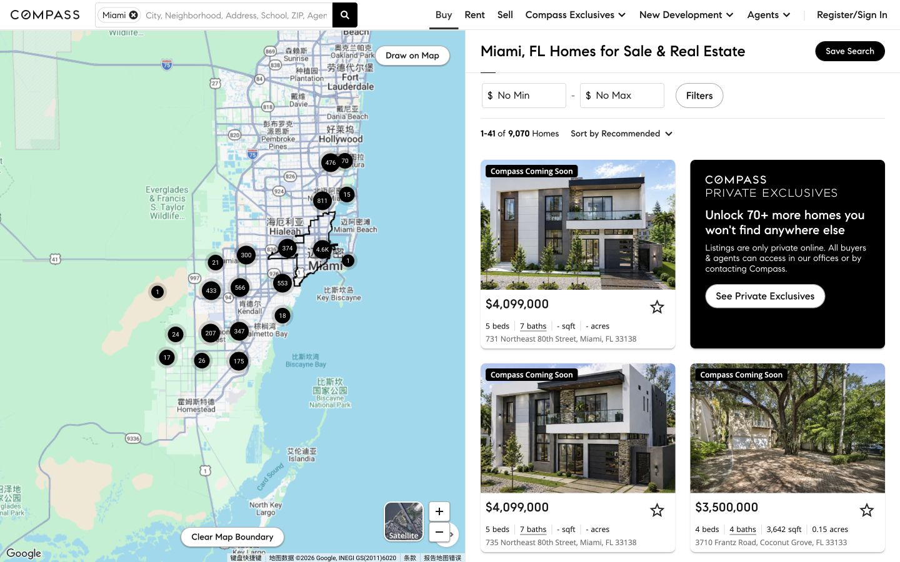](visual-review/original-miami-list-1440.jpg) | [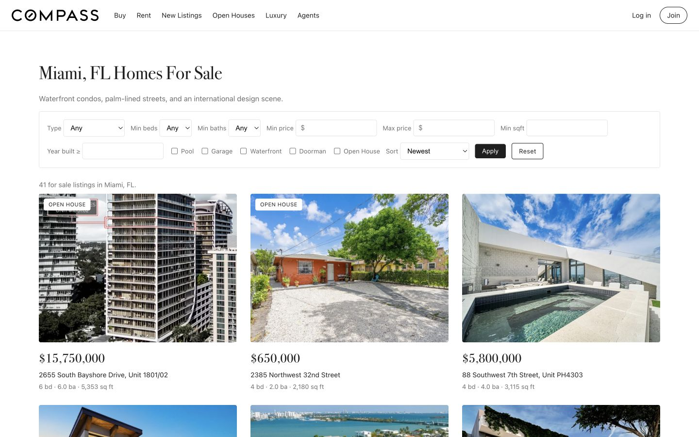](visual-review/before-miami-list-1440.jpg) | [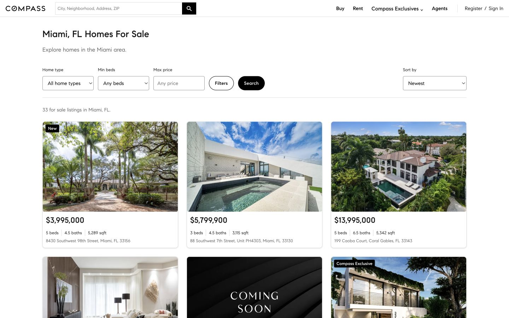](visual-review/after-miami-list-1440.jpg) |

## Scope and intentional differences

- The homepage uses a stable Compass Exclusives mix instead of the live site's personalized recommendations. Task-answer details such as year, MLS and agent information remain in property/profile pages rather than being added to cards.
- Local benchmark accounts, saved homes, collections, tour requests and inquiries are synthetic and resettable. They do not contact the external real-estate service.
- Map/street-view, mortgage, seller, property-history and school-data services are outside this mirror's implemented scope. These are documented omissions, not claimed answer-leak protections.
- Source-backed facts reflect the captured transaction snapshot; historical contributor-only records keep their known basic fields and display unknown details as unavailable. Availability, personalized recommendations and photo inventories can change on the live site.

These screenshots support visual QA. They do not replace full-environment health/reset checks, task quality review, real recorded UI execution or verifier testing.
